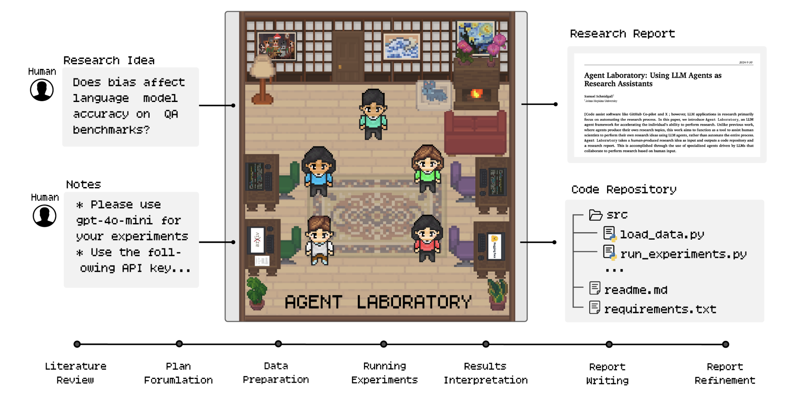

# Local Agent Laboratory: Using Local LLM Agents as Research Assistants

<p align="center">
  
</p>


## Table of Contents

1. [Introduction](#introduction)
2. [Modification](#modification)
   - [Docker](#docker)
   - [Anaconda](#anaconda)
3. [Overview](#overview)
   - [How Does Local Agent Laboratory Work?](#-how-does-local-agent-laboratory-work)
   - [Supported Platforms and Models](#supported-platforms-and-models) 
4. [Environmental Setup](#environmental-setup)
5. [Program Execution](#program-execution)
   - [Now run Local Agent Laboratory!](#now-run-local-agent-laboratory)
   - [Co-Pilot Mode](#co-pilot-mode)
6. [Tips for Better Research Outcomes](#tips-for-better-research-outcomes)
   - [[Tip #0] 🌡️ Adjust proper temperature for each phase! 🌡️](#tip-0-️-adjust-proper-temperature-for-each-phase-️)
   - [[Tip #1] 📝 Make sure to write extensive notes! 📝](#tip-1--make-sure-to-write-extensive-notes-)
   - [[Tip #2] 🚀 Using more powerful models generally leads to better research 🚀](#tip-2--using-more-powerful-models-generally-leads-to-better-research-)
   - [[Tip #3] ✅ You can load previous saves from checkpoints ✅](#tip-3--you-can-load-previous-saves-from-checkpoints-)
   - [[Tip #4] 🈯 If you are running in a language other than English 🈲](#tip-4--if-you-are-running-in-a-language-other-than-english-)
   - [[Tip #5] 🌟 There is a lot of room for improvement 🌟](#tip-5--there-is-a-lot-of-room-for-improvement-)
7. [📜 License](#-license)
8. [Reference](#reference)


## Introduction
This repository is based on [AgentLaboratory](https://github.com/SamuelSchmidgall/AgentLaboratory), but this repository supports local LLMs, 
which the original repo does not. It is especially good if you or your organization has enough GPUs for you to use. Some of possible 
advantages are as follows.

- Don't need to send your data to cloud LLMs.
- Once you download a model, you don't need to access the internet to utilize LLMs.
- Can flexibly and locally finetune a LLM model if you want to.
- Don't need to spend money on pay-as-you-go APIs, which are ambiguous and hard to estimate the total costs that you need to pay.
Besides, even if you decide to utilize one of the cloud LLMs later on, using local LLMs first can give you an approximation of the costs 
before using the cloud ones, such as how many tokens a LLM would produce in order to solve your problem. 
- It is also good if you would like to investigate and experiment what kind of outcomes you can expect when you feed your data for internal 
investigation purposes.


## Modification
I have made some modifications in this repo from the original one.
- Enable you to use local LLMs, which includes **DeepSeek R1** models, instead of cloud ones
- Fixed some prompts for clearer instructions
- Made arguments and some parameters configurable using a JSON config file. For details, please check [config.json](config.json)
- Made clear the import dependencies because the original code frequently uses `import *`, which is ambiguous and not recommended
- Include some examples that were created using Local LLMs. Please refer to [examples](examples/) directory for details

> [!Tip]
> [examples](examples/) were created using end-to-end autonomous mode, which means no human intervention from start to finish. In order to get better results, one way to do it is to include human intervention in some or all of the phases, which is called co-pilot mode in the paper. For more details, please check [Co-Pilot Mode](#co-pilot-mode).

> [!Tip]
> Other ways to get better results are to adjust temperature and prompts, conduct various trials with saved states, and so on. For more details, please check [Tips for Better Research Outcomes](#tips-for-better-research-outcomes).

## 📖 Overview

- **Local Agent Laboratory** is an end-to-end autonomous research workflow meant to assist **you** as the human researcher toward **implementing your research ideas**. Agent Laboratory consists of specialized agents driven by large language models to support you through the entire research workflow—from conducting literature reviews and formulating plans to executing experiments and writing comprehensive reports. 
- This system is not designed to replace your creativity but to complement it, enabling you to focus on ideation and critical thinking while automating repetitive and time-intensive tasks like coding and documentation. By accommodating varying levels of computational resources and human involvement, Local Agent Laboratory aims to accelerate scientific discovery and optimize your research productivity.

<p align="center">
  
</p>

### 🔬 How Does Local Agent Laboratory Work?

- Agent Laboratory consists of three primary phases that systematically guide the research process: (1) Literature Review, (2) Experimentation, and (3) Report Writing. During each phase, specialized agents driven by LLMs collaborate to accomplish distinct objectives, integrating external tools like arXiv, Hugging Face, Python, and LaTeX to optimize outcomes. This structured workflow begins with the independent collection and analysis of relevant research papers, progresses through collaborative planning and data preparation, and results in automated experimentation and comprehensive report generation. Details on specific agent roles and their contributions across these phases are discussed in the paper.

<p align="center">
  
</p>

### Supported Platforms and Models
For this repo, any models from Ollama or Hugging Face, including the recently-announced DeepSeek R1 models, are supported to be used as local LLMs. 
So, pick a platform either `huggingface` or `ollama` using [`--platform`](config.json#L24) argument. E.g. `--platform huggingface`.

If you'd like to check thought processes when you use one of the DeepSeek R1 models, set a flag named [`--show-r1-thought`](config.json#L46) as `true`. That way, you can see the thought processes in the console!


## Environmental Setup

Follow the installation steps below.
```
(Type the following commands at host)
git clone https://github.com/Masao-Taketani/LocalAgentLaboratory.git
docker build -t agentlab .
docker run -it --rm --gpus '"device=[device id(s)]"' -v .:/work agentlab:latest

(If you decide to use Ollama platform, type the following commands after starting the container)
(Start a screen session in order to start Ollama in another session)
screen -S ollama
ollama serve
(Press [Ctrl+a+d] to get out of the screen session)
ollama pull [ollama model name]
```


## Program Execution

### Now run Local Agent Laboratory!

Execute the following command. As for `[your config path]`, please refer to [config.json](config.json).
```
python ai_lab_repo.py --config_path [your config path]
```

### Co-Pilot Mode

If you would like to do co-pilot mode, modify the provided config file. You can intervene any phase(s) you want. In order to do that, modify [here](config.json#L14).


## Tips for Better Research Outcomes

#### [Tip #0] 🌡️ Adjust proper temperature for each phase! 🌡️

Since local LLMs' capabilities are not on par with cloud LLMs' such as GPT-4o, adjusting temperature is crucial. As I have experienced several times during experiments with this repo, I have encountered so many errors especially when LLMs are dealing with writing code and paper. Often times, by adjusting temperature for those phases would work well although intial setting of temperature would not. As I said, `data preparation`, `running experiments`, and `report writing` phases are the most notorious ones! So, be patient, and conduct grid search or whatever you feel like. For reference, I have tried temperature from 0.0 to 1.0. It sometime worked and sometime not. So, see it for yourself! You can adjust each temperature [here](config.json#L36).

-----

#### [Tip #1] 📝 Make sure to write extensive notes! 📝

**Writing extensive notes is important** for helping your agent understand what you're looking to accomplish in your project, as well as any style preferences. Notes can include any experiments you want the agents to perform, providing API keys, certain plots or figures you want included, or anything you want the agent to know when performing research.

This is also your opportunity to let the agent know **what compute resources it has access to**, e.g. GPUs (how many, what type of GPU, how many GBs), CPUs (how many cores, what type of CPUs), storage limitations, and hardware specs.

In order to add notes, you must modify the [task_notes_LLM](ai_lab_repo.py#L694) structure inside of `ai_lab_repo.py`. 

#### [Tip #2] 🚀 Using more powerful models generally leads to better research 🚀

When conducting research, **the choice of model can significantly impact the quality of results**. More powerful models tend to have higher accuracy, better reasoning capabilities, and better report generation. If computational resources allow, prioritize the use of advanced models such as Qwen2.5-72B-Instruct or similar state-of-the-art local LLMs.

However, **it’s important to balance performance and cost-effectiveness**. While powerful models may yield better results, they are often more expensive and time-consuming to run. Consider using them selectively—for instance, for key experiments or final analyses—while relying on smaller, more efficient models for iterative tasks or initial prototyping.

When resources are limited, **optimize by fine-tuning smaller models** on your specific dataset or combining pre-trained models with task-specific prompts to achieve the desired balance between performance and computational efficiency.

-----

#### [Tip #3] ✅ You can load previous saves from checkpoints ✅

**If you lose progress, or if a subtask fails, you can always load from a previous state.** All of your progress is saved by default in the `state_saves` variable, which stores each individual checkpoint. Just set `load_existing` as `true`, which can be found [here](config.json#L3), and pass your saved state [here](config.json#L6) when running `ai_lab_repo.py`

-----

#### [Tip #4] 🈯 If you are running in a language other than English 🈲

If you are running Agent Laboratory in a language other than English, no problem, just make sure to provide a language flag to the agents to perform research in your preferred language. Note that we have not extensively studied running Local Agent Laboratory in other languages, so be sure to report any problems you encounter. You can adjust the language [here](config.json#L48).

----


#### [Tip #5] 🌟 There is a lot of room for improvement 🌟

There is a lot of room to improve this codebase, so if you end up making changes and want to help the community, please feel free to share the changes you've made! We hope this tool helps you!


## 📜 License

Source Code Licensing: This repository's source code is licensed under the MIT License. This license permits the use, modification, and distribution of the code, subject to certain conditions outlined in the MIT License.

## Reference

[SamuelSchmidgall/AgentLaboratory](https://github.com/SamuelSchmidgall/AgentLaboratory)
